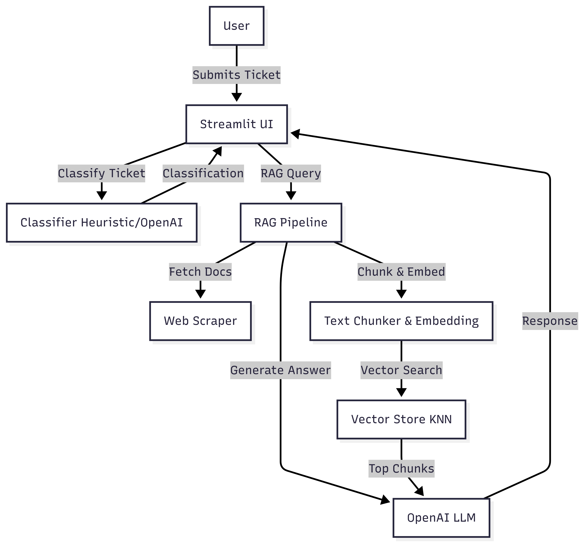

# Atlan Customer Support Copilot

An intelligent AI pipeline combining machine learning classification and retrieval-augmented generation (RAG) for automated ticket triage and contextual response generation.


Component Interactions
Streamlit UI: Single-page application with bulk processing and interactive modes
=======
## Table of Contents
- [Architecture Overview](#architecture-overview)
- [Design Decisions & Trade-offs](#design-decisions--trade-offs)
- [Quick Setup](#quick-setup)
- [Usage Guide](#usage-guide)
- [Problem-Solving Approach](#problem-solving-approach)

## Architecture Overview

### System Architecture



### Component Interactions
- **Streamlit UI:** Single-page application with bulk processing and interactive modes
- **Dual Classification:** OpenAI GPT-3.5 with heuristic fallback for reliability
- **RAG Pipeline:** Documentation retrieval, embedding, and context-aware generation
- **Knowledge Base:** Dynamic web scraping and vector storage for fresh documentation

## Design Decisions & Trade-offs

### 1. Hybrid Classification Strategy
**Decision:** Implement both AI-powered and rule-based classification with automatic fallback.

**Rationale:**
- Ensures system availability without external dependencies
- Provides high accuracy when OpenAI available
- Maintains functionality during API outages
- Controls operational costs
>>>>>>> b496c4f (done changes)

**Trade-offs:**
- ✅ AI Classification: High accuracy, handles nuance, adapts to new patterns
- ✅ Heuristic Fallback: Zero cost, predictable, works offline
- ❌ Limitations: Heuristics require manual updates, less accurate for edge cases

### 2. Single-File Implementation
**Decision:** Complete implementation in single app.py file.

**Rationale:**
- Beginner-friendly and easy to understand
- Minimal setup and deployment complexity
- Rapid prototyping and iteration
- Self-contained with clear data flow


#💡 Design Decisions & Trade-offs
1. Hybrid Classification Strategy
Decision: Implement both AI-powered and rule-based classification with automatic fallback.
=======
**Trade-offs:**
- ✅ Pros: Easy deployment, minimal configuration, straightforward debugging
- ❌ Cons: Limited scalability, harder maintenance at scale


### 3. Dynamic Knowledge Base
**Decision:** Web scraping approach with configurable documentation sources.

**Rationale:**
- Always current with latest documentation
- Flexible source configuration
- No manual content updates required
- Semantic search capabilities

**Trade-offs:**
- ✅ Advantages: Fresh content, automatic updates, multiple sources
- ❌ Limitations: Processing latency, URL dependency, memory usage

## Quick Setup

### Prerequisites
- Python 3.7+
- pip package manager
- OpenAI API key (optional)

<<<<<<< HEAD
#Trade-offs:

✅ AI Classification: High accuracy, handles nuance, adapts to new patterns

✅ Heuristic Fallback: Zero cost, predictable, works offline

❌ Limitations: Heuristics require manual updates, less accurate for edge cases

2. Single-File Implementation
Decision: Complete implementation in single app.py file.

Rationale:

Beginner-friendly and easy to understand

Minimal setup and deployment complexity

Rapid prototyping and iteration

Self-contained with clear data flow

Trade-offs:

✅ Pros: Easy deployment, minimal configuration, straightforward debugging

❌ Cons: Limited scalability, harder maintenance at scale

3. Dynamic Knowledge Base
Decision: Web scraping approach with configurable documentation sources.

Rationale:

Always current with latest documentation

Flexible source configuration

No manual content updates required

Semantic search capabilities

Trade-offs:

✅ Advantages: Fresh content, automatic updates, multiple sources

❌ Limitations: Processing latency, URL dependency, memory usage

⚡ Quick Setup
Prerequisites
Python 3.7+

pip package manager

OpenAI API key (optional)

Installation
bash
=======
### Installation
```bash
>>>>>>> b496c4f (done changes)
# Clone repository
git clone <repository-url>
cd support-copilot-demo

# Create virtual environment
python -m venv venv
source venv/bin/activate  # On Windows: venv\Scripts\activate

# Install dependencies
pip install -r requirements.txt

# Set OpenAI API key (optional)
export OPENAI_API_KEY="your-api-key-here"

# Run application
streamlit run app.py
```

### Configuration
Add environment variables for enhanced functionality:
```bash
# Optional: Customize settings
OPENAI_MODEL=gpt-3.5-turbo
OPENAI_EMBEDDING_MODEL=text-embedding-3-small
RAG_TOP_K=4
CHUNK_MAX_CHARS=800
```

## Usage Guide

### Bulk Ticket Processing
- **Access:** Left column "Bulk ticket classification"
- **Action:** Click "Classify all" to process sample tickets
- **Output:** View classification results with topics, sentiment, and priority

### Interactive AI Agent
- **Access:** Right column "Interactive AI agent"
- **Input:** Select channel, enter subject and body
- **Submit:** Click "Submit ticket" for real-time analysis
- **Response:** Receive classified results and contextual answer

### Knowledge Base Management
- **Access:** Sidebar settings panel
- **Configure:** Edit documentation URLs as needed
- **Rebuild:** Click "(Re)build KB from URLs" to refresh content

## Problem-Solving Approach

### AI Pipeline Design
The system addresses customer support challenges through a logical three-stage pipeline:
- **Input Processing:** Raw ticket ingestion and text preparation
- **Intelligent Analysis:** Dual-path classification with context understanding
- **Contextual Response:** Documentation-grounded answer generation

### UI/UX Design Philosophy
- **Dual-Column Layout:**
  - Left: Batch processing for operational efficiency
  - Right: Interactive mode for real-time support
  - Sidebar: Configuration without disrupting workflow
- **Progressive Disclosure:**
  - Simple interface for basic usage
  - Advanced options available but not required
  - Clear visual feedback for all operations
- **Graceful Degradation:**
  - Works with or without OpenAI API
  - Clear status indicators for system capabilities
  - Helpful error messages and guidance

### Key Capabilities Demonstrated
- Automated Triage: Intelligent routing based on content analysis
- Contextual Understanding: Semantic analysis of ticket intent
- Knowledge Integration: Grounded responses using actual documentation
- Operational Efficiency: Bulk processing for team productivity
- Flexible Deployment: Multiple operation modes for different scenarios

The architecture demonstrates how AI can enhance customer support through intelligent automation while maintaining human oversight and control.

